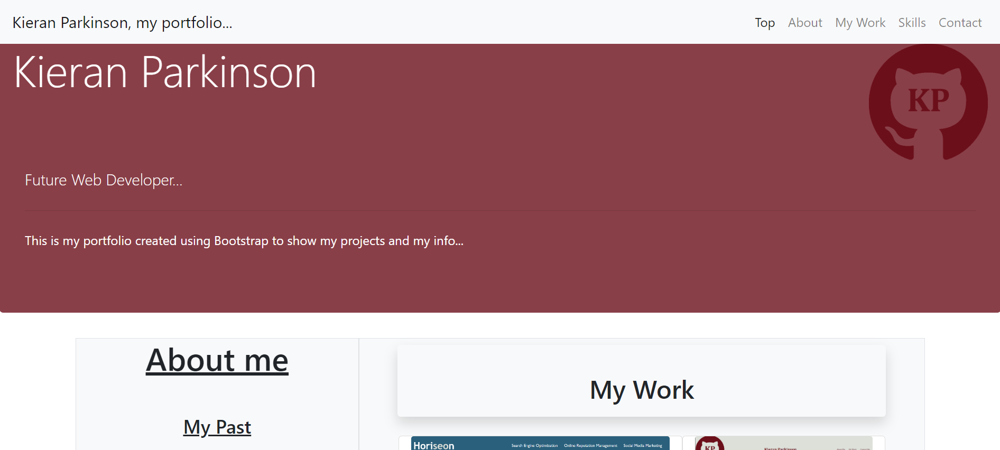

# Bootcamp Challenge 3- Bootstrap-Portfolio

## Skills for life Bootcamp Challenge 03 (Bootstrap Portfolio) short description

The objective of this challenge/project is to create a portfolio page using bootstrap. The portfolio should somewhat resemble my previous portfolio creation (albeit with some design improvements). In this challenge i will use many aspects of bootstrap in order to get a feel of the overall framework and practice using it as in the design process of a web developer using frameworks is an essential part to designing the base layout of a website. A part of this challenge is to use minimal media queries as bootstrap itself is a responsive framework and should handle most media issues automatically.

This will then be used as a demo portfolio page to show that im able to use bootstrap efficiently and will be updated over time as my skills as a developer improve.

### User Story

```
AS A Developer in training
I WANT a bootstrap portfolio page that can be used to display my work and ability to use bootstrap
SO THAT it can serve as a contact reference point and also as a storefront of my skills and work
```

### Acceptance Criteria

My website must work and display correctly on all devices. Also it should show my work (and hold placeholder spots for future works). Most importantly it should use the bootstrap framework. I have achieved this by completing the following:

- When the page is loaded the page presents my name, a avatar (Photo in future), and multiple links to sections about me, my work and etc
- When the links in the navigation are clicked then the UI scrolls to the corresponding section
- All links have some form of hover effect so as to make the page feel more alive
- Application images have attached links to projects themself (more will be added in future when works completed)
- I have used font awesome to create logos for links to my contacts (some links will be added in future)
- Bootstrap has been used to create most of the content

### Screenshot of completed site

The following image shows the web application's appearance



### License

Please refer to license in the Repo

### Website Link

https://britishcryptoguy.github.io/Bootstrap-Portfolio/
